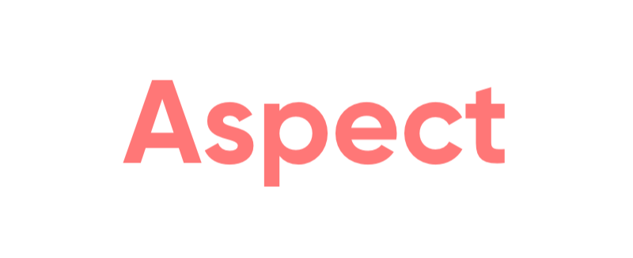

<p align="center"></p>


[](https://github.com/Carthage/Carthage)

[](https://developer.apple.com/swift)


Aspect is a lightweight, pure-Swift library for for aspect oriented programming. This project is heavily inspired by the popular [Aspects](https://github.com/steipete/Aspects). It provides you a chance to use a pure-Swift alternative in your next app.

## Features

- [x] Hook object selector
- [x] Hook different classes selector in the same hierarchy
- [x] Hook class and static selector
- [x] Provide more friendly Swift interfaces

## Usage
### Hook object selector with OC block

```
public class Test: NSObject {

    @objc dynamic func test(id: Int, name: String) {

    }

    @objc dynamic static func classSelector(id: Int, name: String) {

    }
}

let test = Test()

let wrappedBlock: @convention(block) (AspectInfo, Int, String) -> Void = { aspectInfo, id, name in

}
let block: AnyObject = unsafeBitCast(wrappedBlock, to: AnyObject.self)
test.hook(selector: #selector(Test.test(id:name:)), strategy: .before, block: )
```

### Hook object selector with Swift block

```
let test = Test()

_ = try? test.hook(selector: #selector(Test.test(id:name:)), strategy: .before) { (_, id: Int, name: String) in

}

```

### Hook class instance selector with Swift block

```
_ = try? Test.hook(selector: #selector(Test.test(id:name:)), strategy: .before) { (_, id: Int, name: String) in

}

```

### Hook class class and static selector with Swift block
```

_ = try? Test.hook(selector: #selector(Test.classSelector(id:name:)), strategy: .before) { (_, id: Int, name: String) in

}
```


## Requirements

- iOS 8.0+
- Swift 4.0-5.x


## Next Steps


* Support remove aspect
* Improve detail
* Support Cocopods install


## Installation

#### Carthage
Add the following line to your [Cartfile](https://github.com/carthage/carthage)

```
git "https://github.com/woshiccm/Aspect.git" "master"
```


## Contributors


## Backers


### License

Aspect is released under the MIT license. See LICENSE for details.


